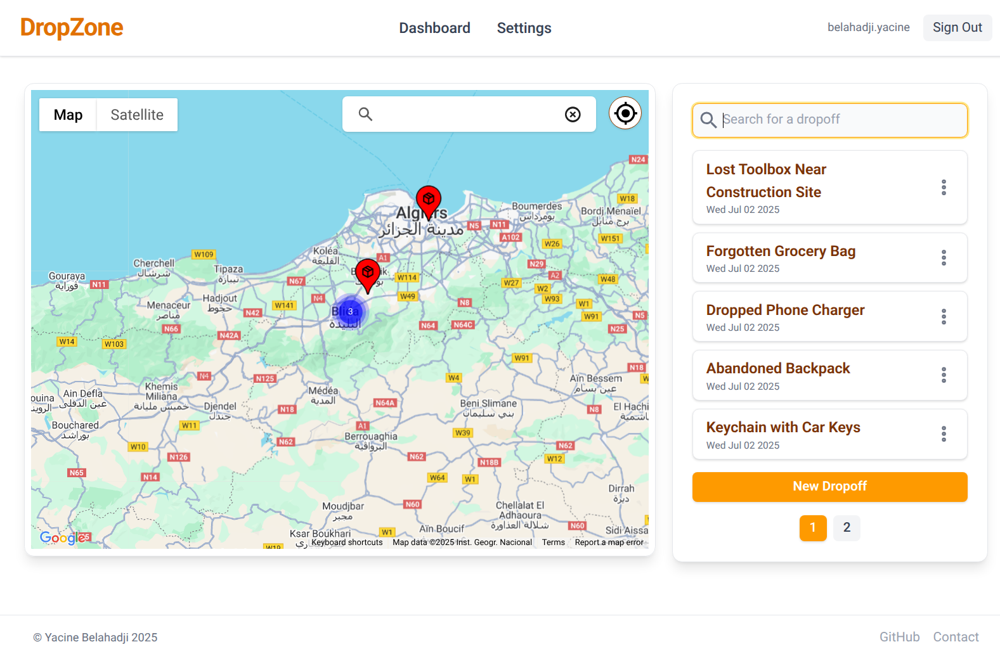
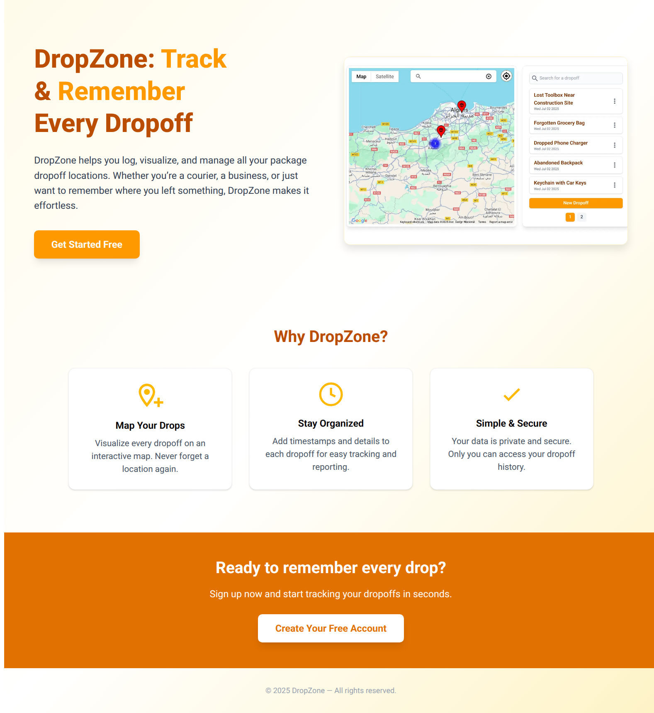
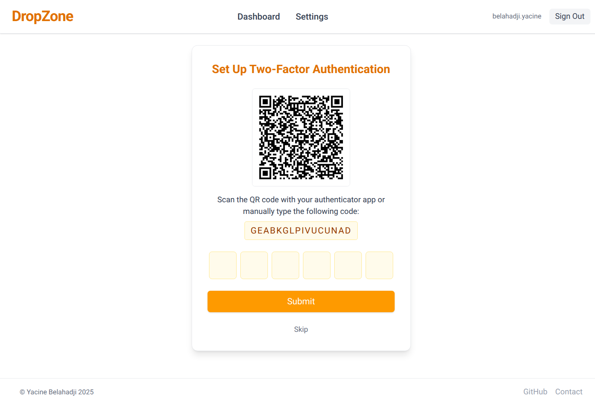
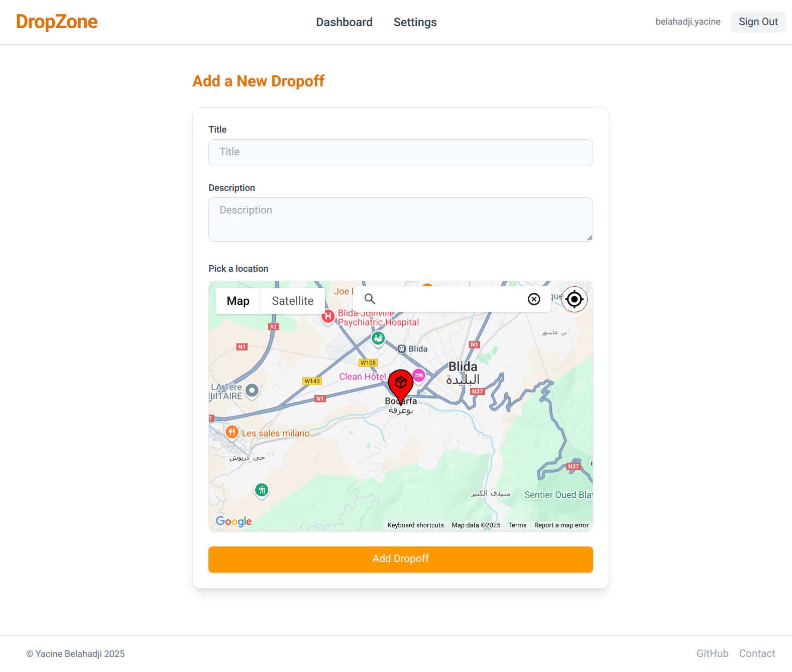

# DropZone

A modern web app to **track, organize, and remember every location where you drop packages or items**.  



## Landing page



## 2FA Setup



## Dropoff Creation




# [Live Preview](https://dropzone-delta.vercel.app/)

> [!NOTE]
> App is hosted with free tier services, first load might take some time.

## Why build this project ?

DropZone was created as a full-stack practice project to explore real-world implementations of Two-Factor Authentication (2FA) and Google Maps API integration.

## Features

- Secure login with optional Two-Factor Authentication (2FA).
- Visualize all your dropoffs on an interactive map.
- Search, edit, and manage your dropoff entries.

## Technologies Used

### Frontend

- Nextjs
- TailwindCSS
- Google maps API

### Backend

- PostgreSQL
- Prisma ORM
- NextAuth
- Zod
- Vercel

## 🛠️ How to Run the Project Locally

### Prerequisites

- [Node.js](https://nodejs.org/)
- [npm](https://www.npmjs.com/)
- [PostgreSQL](https://www.postgresql.org/) (ensure your database is running)
- Basic knowledge of using a terminal (steps are beginner-friendly)

---

### 1. Clone the Repository

```bash
git https://github.com/3antozz/dropzone
cd dropzone
```

### 2. Setup the server

```bash
cd api
npm install
```

**1- Create a .env file in the node/ directory (based on .env.example) and fill in the required environment variables such as:** 

> [!NOTE]
> This app uses google map javascript API, if you want to test this feature locally you should acquire your own google maps API key.

* Database connection URL
* Google maps KEY & map ID
* Auth secret

2- Start the server:

```bash
npm start
```
> [!NOTE]
> The server will run on http://localhost:3000 by default.

### 3. Open in Browser

1- Once the server is running:

2- Visit http://localhost:3000 in your browser

## Libraries Used


### Frontend

- [tailwindcss](https://www.npmjs.com/package/tailwindcss) – A utility-first CSS framework.
- [@vis.gl/react-google-maps](https://www.npmjs.com/package/@vis.gl/react-google-maps) – A TypeScript library to integrate the Maps JavaScript API into a React application.
- [@googlemaps/markerclusterer](https://www.npmjs.com/package/@googlemaps/markerclusterer) – The library creates and manages per-zoom-level clusters for large amounts of markers.
- [use-debounce](https://www.npmjs.com/package/use-debounce) – Debounce functions - used in search query.
- [clsx](https://www.npmjs.com/package/clsx) – utility for constructing className strings conditionally.


### Backend

- [next-auth](https://www.npmjs.com/package/next-auth) – Authentication for Next.js.
- [otplib](https://www.npmjs.com/package/otplib) – Time-based (TOTP) and HMAC-based (HOTP) One-Time Password library.
- [qrcode](https://www.npmjs.com/package/qrcode) – QR Code generator.
- [bcryptjs](https://www.npmjs.com/package/bcryptjs) – For securing passwords by hashing and salting.
- [prisma/client](https://www.npmjs.com/package/@prisma/client) – ORM - Auto-generated and type-safe query builder for Node.js.
- [zod](https://www.npmjs.com/package/zod) – TypeScript-first schema validation with static type inference
